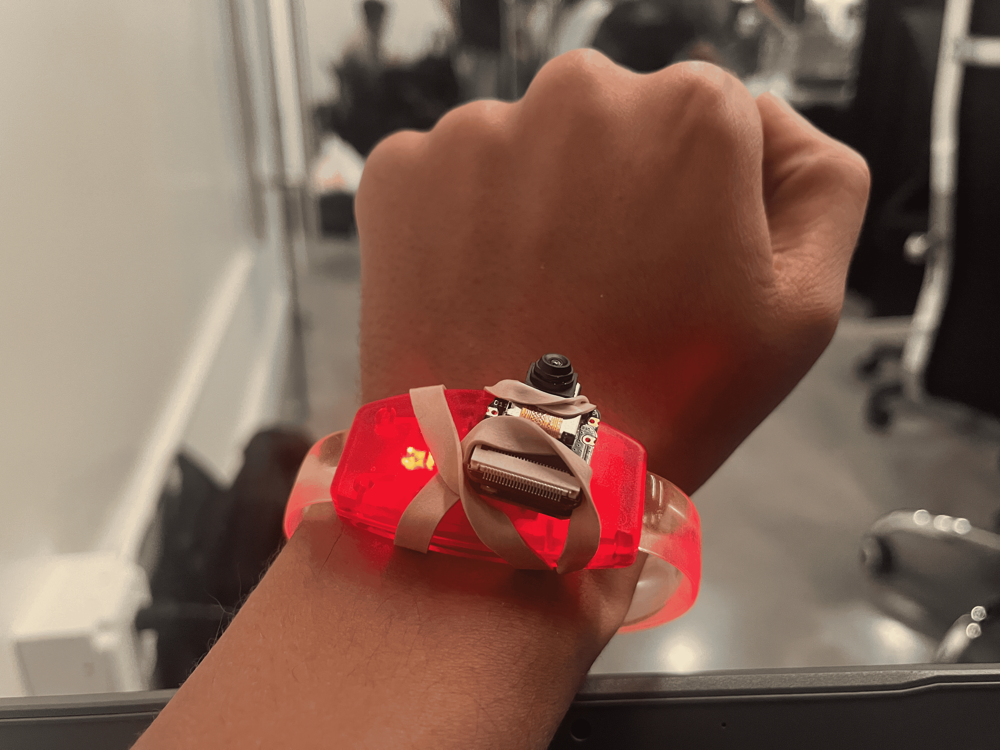

# PalmCall

<p align="center">
  
</p>

**Show your palm. Reach someone who can help.**

PalmCall is a wearable accessibility prototype for moments when reaching for a
phone, speaking clearly, or finding a small button is not realistic. A camera
recognizes an intentional open-palm gesture and asks a voice agent to call a
caregiver.

The idea is deliberately simple: asking for help should not depend on being able
to unlock a phone.

Built at c0mpiled-11 (YC Startup School Hackathon) using the Callwright API by
VOYGR (YC W26).

## What the prototype does today

1. A Seeed Studio XIAO ESP32-S3 Sense serves its camera as an MJPEG stream over
   local Wi-Fi.
2. A laptop reads that stream and decodes frames with Requests and OpenCV.
3. MediaPipe detects one hand, draws its landmarks, and classifies the configured
   `Open_Palm` gesture.
4. A centered palm scoring at least `0.50` triggers the alert flow immediately.
5. The laptop builds a short, factual call brief and uses Callwright to call the
   configured caregiver.
6. The call runs on a worker thread, so the camera window stays responsive.
   Duplicate detections are ignored while a call is already active.
7. Call progress and the transcript are available on the local dashboard at
   [http://localhost:8787](http://localhost:8787).

Dry-run mode exercises the complete flow without ringing a phone or spending
credits. Live mode must be enabled explicitly.

```text
open palm
    |
    v
ESP32 camera --MJPEG--> laptop vision --alert event--> TriggerHub
                                                       |
                                                       v
                                             factual call brief
                                                       |
                                                       v
                                            Callwright --> caregiver
                                                       |
                                                       v
                                         outcome + local dashboard
```

The prototype currently knows that the wearer deliberately made the configured
help gesture. It does not claim to know why they need help, whether they fell, or
what is happening outside the camera classifier. Device vibration patterns are
wired as software hooks, but physical feedback to the wearable is still a next
step.

## Repository layout

```text
backend/
  pyproject.toml              Python project and dependencies
  .env.example               Safe configuration template
  snapcall/
    vision/
      detector.py            MediaPipe gesture loop
      stream_viewer.py       Reconnecting MJPEG reader
      dispatch.py            Vision-to-call handoff
    trigger.py               Worker thread and duplicate-call protection
    flows.py                 Caregiver escalation policy
    briefs.py                Factual voice-agent instructions
    callwright.py            Callwright API client
    server.py                Dashboard and HTTP trigger endpoint
    cli.py                   Dry-run, live-call, and test commands

firmware/
  snapcall_cam/               Arduino IDE sketch for the XIAO ESP32-S3 Sense
```

The product is called **PalmCall**, but the Python package remains named
`snapcall` for compatibility with the existing code and command line. Renaming
the import namespace is not required to run or demo the project.

## Requirements

- Python 3.11 or newer
- [`uv`](https://docs.astral.sh/uv/)
- Seeed Studio XIAO ESP32-S3 Sense with the firmware uploaded through Arduino IDE
- Laptop and ESP32 connected to the same 2.4 GHz Wi-Fi network or phone hotspot
- A Callwright API key for preflight checks or live calls

If `uv` is not installed:

```powershell
py -m pip install --user uv
```

The commands below use `py -m uv`, which works even when the `uv` executable is
not yet available directly on the Windows `PATH`.

## Setup

Run all Python commands from `backend/`:

```powershell
cd backend
py -m uv sync --extra vision
Copy-Item .env.example .env
notepad .env
```

Set at least:

```env
CALLWRIGHT_API_KEY=your-key
CALLWRIGHT_DRY_RUN=1
CALLWRIGHT_ALLOWED_NUMBERS=+14155550199
CAREGIVER_PRIMARY_PHONE=+14155550199
```

Phone numbers must use E.164 format: a leading `+`, country code, and number.
Keep the allowlist enabled during development so a typo cannot call a stranger.
Do not commit `.env`.

## Run the complete demo

Read the ESP32's numeric IP from Arduino Serial Monitor. Windows mDNS can be
unreliable, so prefer the IP over `snapcall.local`.

Start with a simulated call:

```powershell
py -m uv run --extra vision python -m snapcall.vision.detector --address 172.20.10.2
```

Replace `172.20.10.2` with the board's current IP. The first qualifying open palm
triggers the flow; no hold or additional countdown is required. The camera loop
automatically retries when the hotspot temporarily drops.

Before placing a real call, verify the key, credits, target, and allowlist:

```powershell
py -m uv run python -m snapcall.cli preflight
```

Then deliberately enable live calling:

```powershell
py -m uv run --extra vision python -m snapcall.vision.detector --address 172.20.10.2 --live
```

`--live` rings a real phone and may spend Callwright credits.

## Test without the camera

Use the keyboard as a gesture:

```powershell
py -m uv run python -m snapcall.cli listen
```

Or start the dashboard and HTTP trigger endpoint:

```powershell
py -m uv run python -m snapcall.cli serve
```

In a second PowerShell window:

```powershell
Invoke-RestMethod `
  -Method Post `
  -Uri http://localhost:8787/trigger `
  -ContentType application/json `
  -Body '{"source":"manual-test"}'
```

These commands remain dry runs unless `--live` is passed.

## Safety and scope

- PalmCall is a hackathon prototype, not a certified medical alert device and
  not anyone's sole emergency lifeline.
- `.env` is ignored by Git; API keys must never be committed or printed.
- Live calls must target people who have agreed to receive them.
- The allowlist is enforced before every dial.
- The call brief reports only what the system actually observed.
- If there is immediate danger, contact local emergency services directly.
